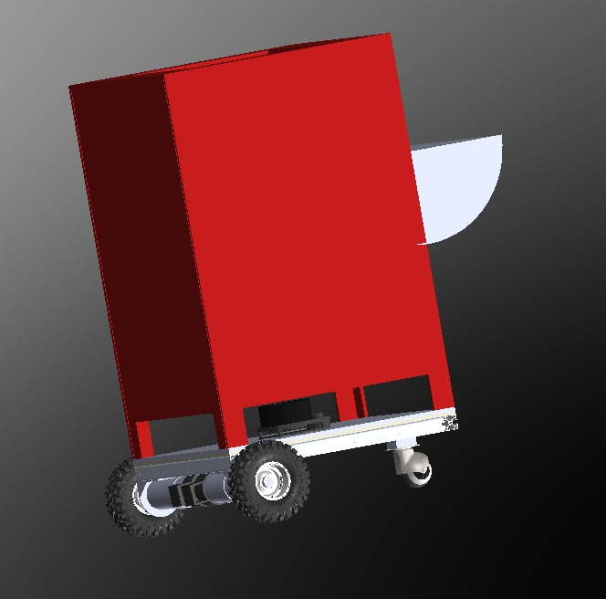
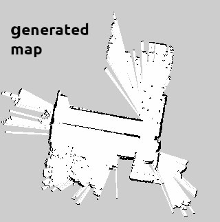
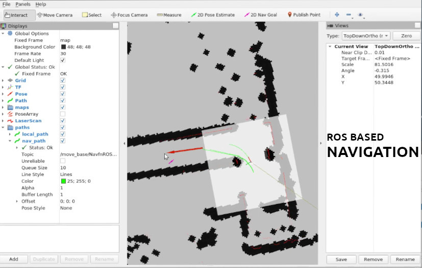

# Riggu-2023
2023 Riggu 

Riggu is a autonomous mapping and navigation robot with additional human interface features. 
It has a  QT based GUI and voice recognition and speech functionality as well. It utilises gemini api for intelligence.  
</br>
# Built With


# Riggu CAD model
<div align='center'>
    
</div>

# map of robotics lab generated using gmapping package in ROS

<div>
    
</div>

# Navigation of the robot visualised in RViz

<div>
    
</div>

# how to run riggu docker image

install docker using 

```bash
sudo apt install docker.io
```

cd into cloned directory
and build image using this command 

```bash
sudo docker build -t riggu_img .
```

to run the image w/o a gui
```bash
sudo docker run -it --net=host -v "$PWD":/ws  riggu_img
```
with display
```bash
xhost +local:root
```
```bash
sudo docker run -it --net=host \
    --env="DISPLAY" \
    --env="QT_X11_NO_MITSHM=1" \
    --volume="/tmp/.X11-unix:/tmp/.X11-unix:rw" \
    -v "$PWD":/ws  riggu_img
```
with devices
```bash
 sudo docker run -it --net=host \
 --env="DISPLAY" \
 --env="QT_X11_NO_MITSHM=1" \
 --volume="/tmp/.X11-unix:/tmp/.X11-unix:rw" \
 --privileged -v /dev/bus/usb:/dev/bus/usb \
 -v "$PWD":/ws  riggu_img
```

